# 🏥 Distributed Cloud Clinical Telemetry Ingestion Hub

An enterprise-scale distributed streaming data framework engineered to consume, process, validate, and securely log real-time clinical patient telemetry monitoring streams at scale across isolated cloud clusters.

## ✨ Implemented Architectural Features:
* **High-Throughput Streaming Pipeline:** Processes multi-threaded streaming data arrays, parses real-time patient vital variables, and implements structural outlier filters to isolate high-risk cardiovascular emergencies into separate queues.
* **Zero-Knowledge Cryptographic Masking:** Executes high-security SHA-256 cryptographic hashing algorithms combined with an architectural tracking salt to completely de-identify Protected Health Information (PHI) for strict HIPAA/clinical compliance.
* **Senior Performance Benchmarking Engine:** Integrates a microsecond-accurate network latency diagnostic harness to measure processing duration metrics down to the millisecond, verifying server stability under peak hospital traffic.
* **Production-Grade Configurations:** Automated with an optimized Python `.gitignore` matrix to keep cloud deployment code repositories light and professional.

## 🛠️ System Tools & Architecture
* **Language Core:** Python 3.x (Advanced Telemetry Validation Metrics)
* **Performance Control:** Microsecond Latency Chronometers (`time.perf_counter`)
* **Tracking Pipeline:** Git Version Control DevOps Network Pipeline
## 📐 System Topology & Data Flow Vector Matrix

```mermaid
graph TD
    A[🏥 Live Hospital Vitals Stream] -->|Raw JSON Network Package| B(🚀 Ingestion Node Cluster)
    B --> C{🛡️ Privacy Security Mask}
    C -->|SHA-256 Cryptographic Hash| D[👤 Anonymized Patient Token]
    B --> E{📊 Data Quality Engine}
    E -->|If Systolic > 250 or HR > 220| F[🚨 Emergency Queue Isolated]
    E -->|Valid Biometric Metrics| G[💾 High-Throughput Ledger]
    G --> H[⏱️ Latency Chronometer Benchmarking]
    H -->|Metrics Logged in ms| I[📈 System Analytics Dashboard]

    style A fill:#0f172a,stroke:#38bdf8,stroke-width:2px,stroke-dasharray: 5 5
    style B fill:#1e1b4b,stroke:#818cf8,stroke-width:2.5px
    style C fill:#31102f,stroke:#f43f5e,stroke-width:2px
    style E fill:#1c2d37,stroke:#34d399,stroke-width:2px
    style F fill:#450a0a,stroke:#ef4444,stroke-width:3px
    style I fill:#064e3b,stroke:#059669,stroke-width:2px
```

